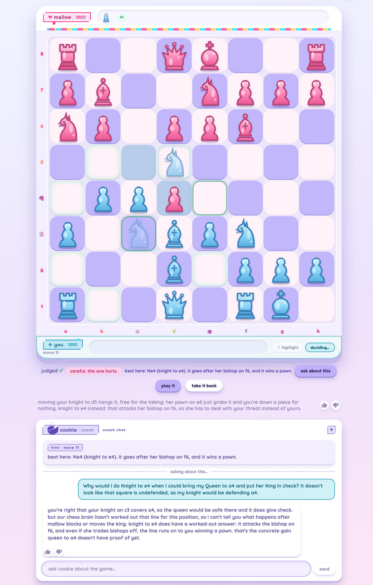
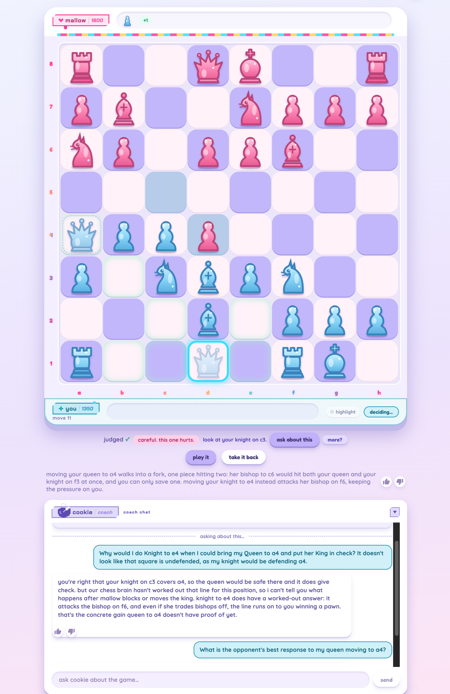
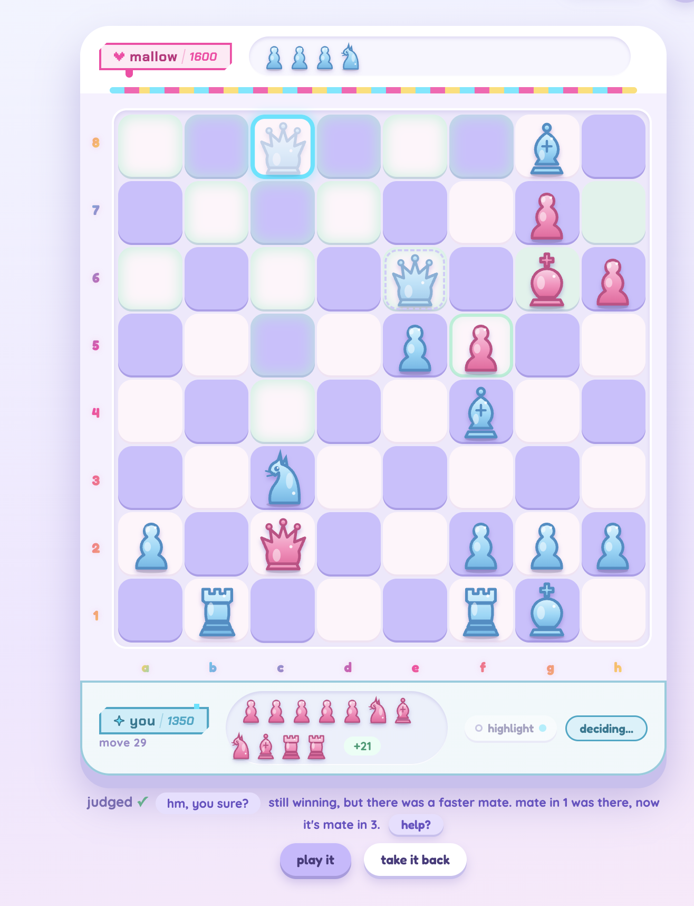
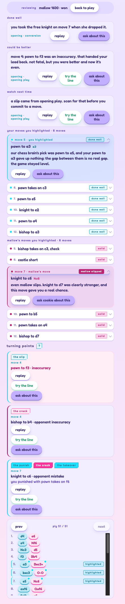
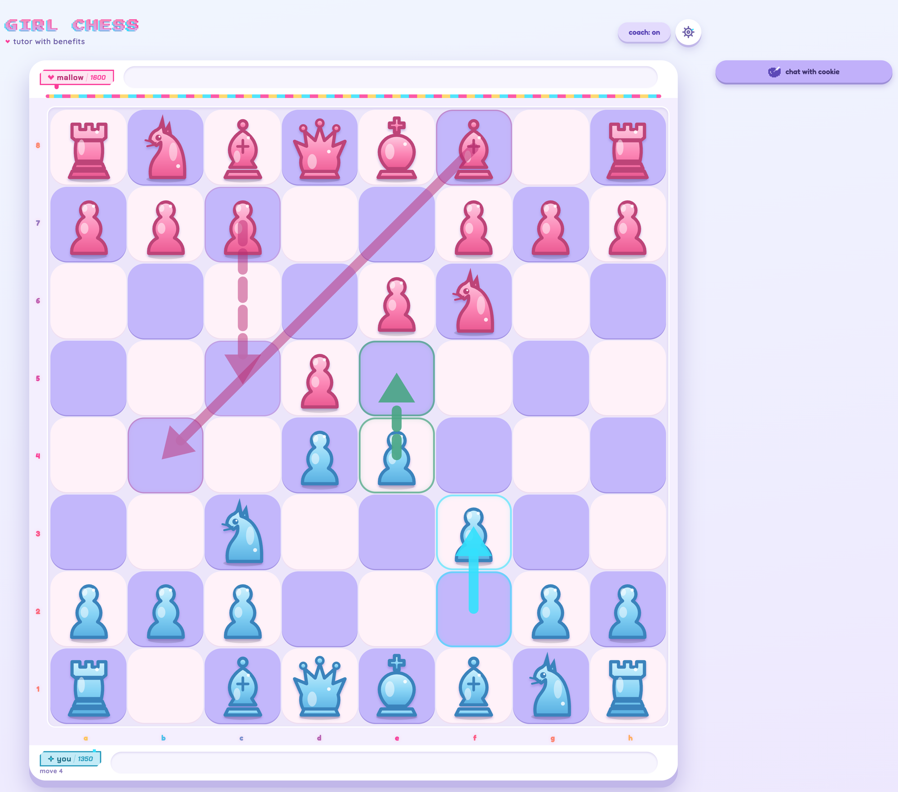

# Girl Chess

A personal AI chess tutor that runs locally on your machine. Play against mallow, human-feeling opponent at nine strengths, who's beatable due to warnings, progressive hints, and a plain-English debrief after every game. The repo ships 51 of my own finished games and 113 coach exchanges from them. The fastest way to assess a chess tutor is to read it coaching real mistakes.

I am a woman who learned chess 3 months ago in my 30s. Most chess apps felt cold and masculine, so I built the tutor I wanted: feminine-first and approachable, for an underserved slice of a massive market.

## Gameplay: the opponent, the judge, and the coach

Three layers do the thinking. Stockfish does the chess math. Maia is the human-feeling opponent, run through the open source lc0 engine, named mallow. Claude Sonnet 5, through the Agent SDK, writes the coach's chat answers and per-move notes.

By default, selecting a move is not playing it. Click a piece, click a square, and the judge evaluates that move while your piece sits ghosted on the target. A second click or "play it" confirms; "take it back" retracts.

Move 11 of a real game, knight to d5 selected but not confirmed: I ask the coach why not queen to a4 instead.



This chat reveals a current weakness of our coach integration; the coach doesn't always correctly fetch the chess math available to it as well as our hint tree does. So I selected queen to a4 instead: the judge found the fork and better explained the misstep, so I took it back and played the knight as recommended.



Move 29 of another game, 21 points up: the judge nudges a winning move because a faster checkmate was there.



Players lose won games by failing to close them in the endgame (and middlegame conversion for that matter!). Can you spot the mate in 1 here?

## The debrief

After the game the app builds a full debrief. Stockfish finds the turning points and the debrief writes them up in plain English, so you learn what decided the game without reading notation. Cards fall into three groups: done well, could be better, watch next time. Turning-point badges use seven fixed words (the slip, the crack, the punish). "ask about this" on a card opens the coach chat on that moment so the coach gives a stateful answer.

The debrief after beating mallow at 1600 (game 191 in the demo database).



"replay" puts the moment back on the board with arrows drawn. "try the line" drops you into play from the mistake so you can make the call again.

The move-4 turning point replayed: solid arrows for what happened, dashed for what didn't. Much clearer for beginners than algebraic chess notation!



## Coach guardrails

The coach kept giving confidently wrong advice, and the easy story was "try a bigger model" or "shrink the system prompt." I measured our baseline first. The cause was a fact gap: the coach reasoned about chess from facts it never had. Feeding it the facts and forcing it to stick to them deterministically, not a bigger model, fixed it. Placement errors in that measurement went from 7.5% to 0; explanation answers from 13-15 seconds to about 4. In the committed games, one first draft in nine still trips the placement check.

Two guardrails: every coach reply is checked before it reaches you, and the debrief code is checked before it ships. On questions about the board, a claim about a move, placement, defence or checkmate that the facts don't support gets one retry, then a written fallback answer. The check overcorrects: ten of the 113 committed chat replies ended in a fallback answer. That is the trade I chose, so nothing the checks can disprove reaches the player. The post-game analysis is written by code, not the model, from a replay of the game's own moves. Nineteen deterministic rules check it against that replay over every finished game in my history before any change can merge. That took the debrief's "you could have won faster" claims from 60% contradicted to about zero. [docs/evaluation.md](docs/evaluation.md) explains the checks, thinking budget iterations, and model comparisons; [docs/technical-decisions.md](docs/technical-decisions.md) has the fact-gap diagnosis.

*Three limits*:

- Facts pass from Stockfish through a fact layer to Sonnet, and that handoff is still lossy. The coach can't yet fetch everything the judge and the hints work from, which is why the queen-to-a4 refutation is more complete from the judge than from the coach. That is the open alignment work.
- Missed checkmates are measured only on the flagged move, not the whole game, so a second one later in the game goes uncounted.
- My 1350 rating is a hard-coded placeholder anyone who downloads this inherits. A rating judged from how you actually play is on the roadmap.

## Running the game locally

```
npm install  # Node 20.19+
./setup.sh   # once, macOS + Homebrew: installs Stockfish + lc0, downloads Maia weights for all nine Elo bands
npm run dev  # server on 3001, web client on 5173
```

Open http://localhost:5173. Everything but the coach's words runs on your machine: no API key, no monetization layer. The coach is an optional menu toggle and needs your logged-in Claude subscription and wifi connection. Without one, the game, opponent, judge and post-game analysis still work on computed facts. The chat can run on open-source Ollama instead, but as a Claude girlie I haven't optimized it.

Your games go to `data/girlchess.db`, created on first run, and are never committed.

## How it's built

I designed and built this 0-to-1 as a product manager's first vibed project ever, via Claude Code: spec, plan, execute, adversarial review, gate. A live playtest and evals drove each increment.

<details>
<summary>Developer detail</summary>

- Four text surfaces reach the player. Two are model-written, the coach chat and the per-move note; two are code, the hint ladder and the post-game analysis, templated from Stockfish facts.
- `npm run gate` is the local merge check. It fails on any violation of the rules in `src/review/debriefInvariants.ts`.
- Skipping `setup.sh` fails loudly: the server refuses to start and names the missing Elo bands. Deliberate. A missing Maia band used to silently swap in a strength-limited Stockfish, a far less human opponent.
- `data/girlchess-demo.db` is committed on purpose: 51 games with full move lists, each coach reply's final draft with its validation result, my questions, and my thumbs. `tools/make-demo-db.sh` builds it from my live database through a read-only handle: finished games only, backend-error traces dropped. No names, addresses, emails or keys; I scanned it for them.

</details>

## Docs and credits

The docs are published at [tiffygk.github.io/girl-chess-demo](https://tiffygk.github.io/girl-chess-demo/), so none of them need a clone to read.

- [docs/README.md](docs/README.md) is the front door: the product spec, one increment plan-to-gate, three real review catches, and the coach-transport decision.
- [docs/evaluation.md](docs/evaluation.md) is how the tutor is kept honest.
- [CLAUDE.md](CLAUDE.md) is the architecture map and runbook a future Claude session reads first.

Built on Stockfish, Maia through lc0, and Claude Sonnet 5. The mistakes in the committed games are mine.
