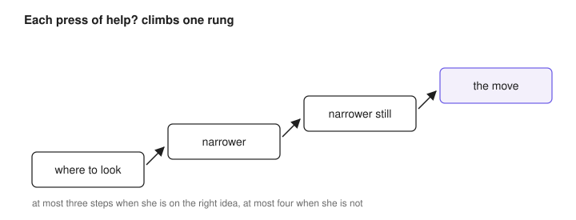
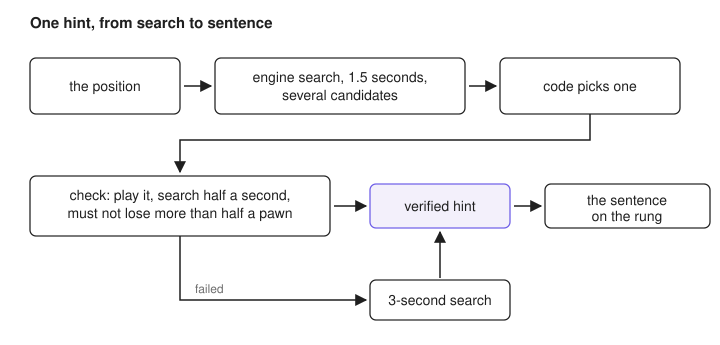
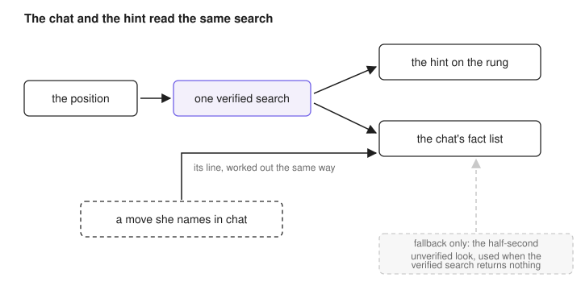

# The hint ladder and the coach

## What the player sees

When the judge sees a threat in the move she is considering, a "help?" button appears under the board, and each press climbs one rung: the first says where to look without naming a move, later rungs narrow it, the last shows the move. After the first press the button reads "more?".

The ladder is short on purpose: at most three rungs when she is already on the right idea, at most four when she is heading for a mistake.

The rung wording comes from fixed sentences chosen by code, not from a language model. That makes it instant, and it means a rung can never invent anything.

Below the ladder, a one-line band explains the position in the coach's voice. That line is a model call, with a fixed-sentence fallback if the model is slow.

The chat is the third surface, where she asks questions in her own words.

Where this lives: `src/game/hintFlow.ts`, `server/annotator/hint.ts`.

## How a hint is checked before it is shown

When she asks for help, the engine searches the position for 1.5 seconds and returns several candidate moves, not one. Code picks among them, preferring a quiet move over a trade when the gap is small, about a third of a pawn.

The pick is then tested: code plays it on a copy of the board and searches again for half a second, confirming it does not lose more than half a pawn. A move that fails is replaced by the result of a deeper 3-second search. The move on the rung is one of those two, a move that passed the check or the deeper search's answer, and that is what "verified" means on this page.

Asking twice on the same position does not search twice; the app reuses the verified answer. Two short searches of the same position can land on different near-equal moves, which happened once, on 2026-08-28. The reuse rule is the fix.

Where this lives: `server/annotator/hint.ts`, `server/game/manager.ts`.

## How the chat stays on the hint's facts

The chat never sees the board alone. It gets a fact list assembled by code, and the verified hint for the exact current position is part of that list.

Two rules added on 2026-09-08 closed the gaps.

First, the chat no longer takes its own weaker read of the position. If she opens the chat on a position no hint has searched yet, the app runs the same verified search the hint uses, keeps the result for that position, and only then asks the model. The older half-second unverified look survives for one case: when the verified search returns nothing at all, for example when the game is over.

Second, a move she names in chat but has not played now gets its own line: the app works it out by the same verified method and adds it to the facts. The coach answers about her move rather than about a guess.

The band is ground truth for the chat. The chat may never name a different best move, and it may never deny a threat the band already stated.

Where this lives: `server/game/manager.ts`, `server/coach/chat.ts`, `server/coach/candidateMove.ts`.

## What it still gets wrong

One recorded defect is still open. Early in game 197, the chat said a pawn move to f3 "doesn't defend e4". That was wrong, because f3 sits diagonally next to e4. The reply was served before the verified-search rule above shipped, and the replay check names it as a known defect rather than counting it as fixed. The next round has to prove it gone.

A second gap is narrower. The post-game review chat does not yet carry the hint's findings, so its answers rest on the stored analysis only.

Where this lives: `tools/replay-check.ts`.

## Latency, measured 2026-09-08

These are measured on the owner's machine, over her own games.

| call | p50 | p90 |
| --- | --- | --- |
| chat | 8.1 s | 21.0 s |
| nudge (band) | 4.1 s | n/a |
| warning (band) | 3.6 s | n/a |
| a chat regen | 33.5 s average (vs 8.2 s without) | n/a |
| cheapest model call observed | 3.3 s | n/a |

The standing ceiling for any change to a coach reply is one to two seconds.
