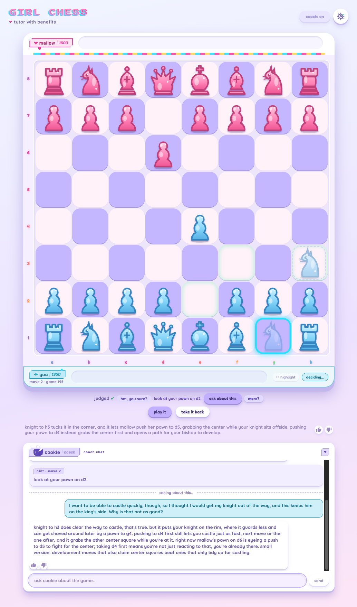

# Girl Chess

A personal AI chess tutor I designed and built 0-to-1 by directing Claude Code.

Girl Chess plays you at nine strengths, 1100 to 1900, with human-feeling opponents instead of raw Stockfish. It feels like playing a person, not a wall. After each game it finds the moments that actually swung the result, shows you the better move on the board, and explains what it would have opened up in plain English, not notation. A coach named **cookie** sits alongside the whole time, in its own lavender corner: it warns you before a bad move lands, answers questions about any hint or turning point through an inline chat, and won't keep a line the checks can disprove.

I learned chess three months ago in my 30s. Most chess apps felt cold and masculine, so this one is feminine-first and approachable.

## What playing it looks like

Move 2 of game 195: the knight is selected and ghosted on h3, not yet played. Before you confirm, the judge (the app's move review) weighs the move and its hint tells you where to look; "more?" adds detail. "ask about this" opens the coach chat on that moment, so you can push back and get the reasoning, built on the same facts as the hint.

Game 191 in the demo database, a win over the opponent mallow at 1600: the debrief. Three card groups (done well, could be better, watch next time), badged turning points, the move list. "replay" puts any moment back on the board with arrows; "try the line" drops you into play from the mistake.

## How it was built, and what shipped

I directed an AI coding agent through a structured build process instead of writing code by hand. The adversarial review caught a security hole and an honesty bug before either shipped. A later measurement pass caught something the review couldn't: the coach's advice was sometimes wrong not because the model was weak, but because it was never given the facts it needed. See **[decisions, measured](technical-decisions.md)** for the finding, the fix, and the harness that re-runs the model comparison.

Shipped as of 2026-09-09: increment 3.95 and the rounds since, each checked before it merged. Open games survive a server restart; past games are listed by day, with a back button that leaves a game without ending it. Opponents run to 1900, and a fresh clone gets `npm run doctor`. Increment 4 (spaced-repetition drills, a progress dashboard, "it remembers") is roadmap, not built. It's included anyway: red-teaming your own plan before you build it is part of the process this repo is meant to show.

## Start here: the product spec

Before any code existed, I wrote the spec. **[PRD-lite: Girl Chess →](prd-lite.md)** names three hypotheses and the metric that would kill each one.

> North star: every session teaches me something I can name.
>
> The magic moment is a two-game arc, the lesson loop. Game one: I'm about to walk into a tactic I'd normally miss. The coach's warning makes me stop. I spot the danger myself, avoid the critical error, ask what move type this is, get one answer at my level. I win. Game two: the coach quietly recreates the same situation. This time I beat it with no help.

Everything below is that spec turned into a shipped, gated build.

## The build process

1. **[One increment, plan to gate](increment-3.95.md)**: increment 3.95 end to end. The plan an AI agent wrote from playtest feedback, broken into 11 tasks, and the live gate it had to pass before merging.
2. **[Where the review earned its keep](where-the-review-earned-its-keep.md)**: three bugs the adversarial review caught in one increment. A coach calling a loss a win, a security hole, and a regression, all before they shipped.
3. **[Build-plan red team](build-plan-red-team.md)**: before increment 4, a three-agent panel (two critics, one defender separating real problems from nitpicks) attacked the plan and found my own north star metric didn't work. The finding is included, unsoftened.
4. **[The component library](https://tiffygk.github.io/girl-chess-demo/component-library.html)**: every front-end component that shipped, each one beside the alternatives it beat and the reason it won. The archive tab keeps the roads not taken. It is the working file I design against, not a writeup made afterwards, so it carries the shorthand of a real one; pruned on 2026-09-08 to what shipped, its log runs through 2026-09-09.

## Decisions, measured

Three live decisions, weighed in the open, all shipped and merged: **[technical-decisions.md →](technical-decisions.md)**
1. **The coach's advice was sometimes wrong, and it wasn't the model.** The cause was a fact gap. The coach was reasoning about the position from facts it never had. Giving it those facts fixed both numbers in the July 2026 eval: placement errors went from 7.5% to 0, and explanation answers from 13-15 seconds to about 4. Both held for a smaller model and a larger one, so model tier became a downstream decision. The committed harness (`tools/coach-eval/`) re-runs the model comparison. The placement number comes from that July eval, which the harness does not repeat.
2. **The coach was too slow.** The trace-driven diagnosis, three options, and why I warmed the free path (an in-process Agent SDK backend) instead of paying for a metered API.
3. **The coach gave me bad advice about a defended piece.** Why the fix was a computed fact, not a bigger model or an extra engine call.

A fourth, from 2026-09-08, lives in pull requests #15 to #17, not that page. **The chat could have contradicted its own hints.** I measured first: 142 chat replies paired with the hint ladder's facts for the same position; none recommended a different move. Now the chat reads that same verified search during play, for the position or any move you ask about but haven't made yet.

## How the tutor is kept honest

Every sentence a player reads gets checked, and the check differs by surface: **[evaluation.md →](evaluation.md)**. Four text surfaces, only two of them written by a model. Nineteen rules replay the post-game analysis against my real games before any merge, sorted into the four ways generated text can lie. The audit that prompted it found the analysis telling me I had played inefficiently on moments the moves disproved, and the corrected count is the one published.

Two guardrails: every coach reply is checked before it reaches you, and the debrief code is checked by those nineteen rules before it ships. On questions about the board, a claim about a move, placement, defence or checkmate that the facts don't support gets one retry, then a written fallback answer. The check overcorrects: ten of the 113 committed chat replies ended in a fallback answer. That is the trade I chose, so nothing the checks can disprove reaches the player.

Two instruments live in there, and they did different jobs. Keeping them apart is the point.

- **The accuracy fix:** seven surfaces were each deriving the same chess fact on their own, so one wrong idea had seven routes to the screen. Routing all seven through a single verified source and adding a regression check to the merge gate fixed it. Before, six of the ten "you could have won faster" claims I audited were contradicted by the moves. Now the rule that checks those claims counts about zero across every finished game. The audit, the population, the named source and the named check are traced in [evaluation.md](evaluation.md#the-sixty-percent-and-what-zero-counts).
- **The blinded A/B evals:** Sonnet against Opus, across thinking budgets, with the grading key sealed until after I had written every grade. Those tuned answer quality, latency and fallback rate, and settled which model to run. They did not move the accuracy number.

## Two ordinary questions, from the record

The game-195 screenshot above is the showpiece. Most coaching is smaller. Two exchanges from `data/girlchess-demo.db`, both against mallow at 1300, both games I won.

Game 141, before my tenth move. I had a bishop check lined up and asked why the judge disliked it:

> **Why is this bad?**
>
> moving your bishop to b5 gives check, but mallow just answers with pawn to c6, hitting your bishop again. you'd have to move it a third time this game, burning a tempo while she gets to develop for free.

I played Be2 instead and rated the answer up.

Game 148, asked from the debrief after the game, about my second move:

> **did she go to d5 after i went to g4?**
>
> no, after your pawn to g4 she played her pawn to a5. the pawn to d5 you're thinking of only shows up in our chess brain's line for the move it wanted instead: pawn to d4.

Two follow-ups on the same moment sit beside it, one rated down, one up. The 82 thumbs in the database split 48 up, 34 down. These are `advice_traces` rows 63 and 107; my questions are in the `prompt` column.

## Live demo

A working local app, not a hosted product. It runs on your own machine, and the [repository README](https://github.com/tiffygk/girl-chess-demo#running-the-game-locally) covers what you need and what degrades if you skip a step.

Five self-contained pages, no clone needed.

How it is built:
1. [The architecture walkthrough](https://tiffygk.github.io/girl-chess-demo/architecture.html): how a move becomes a checked sentence.
2. [The component library](https://tiffygk.github.io/girl-chess-demo/component-library.html): the working design file, item 4 above.

Three evaluations, in the order they happened. Each answers the question the one before it left open:

3. [Sonnet against Opus](https://tiffygk.github.io/girl-chess-demo/coach-eval-v3-dashboard.html) (2026-07-23): which model to run, graded blind with the key sealed. It carries its own correction where later work moved one of its numbers.
4. [Why the answers feel slow](https://tiffygk.github.io/girl-chess-demo/coach-quality-dashboard.html) (2026-08-02): the latency investigation. It ends on a question it could not close, and says so.
5. [Three thinking budgets, one pick](https://tiffygk.github.io/girl-chess-demo/thinking-arm-dashboard.html) (2026-08-03): the three-repeat run that closed it. Shipped the next day.

Then [technical-decisions.md](technical-decisions.md) and this doc, for anything that needs receipts.

## Code

The rest of this repository is the app: `server/` (game engine, coach, analysis), `src/` (React client), `CLAUDE.md` (the architecture map and runbook a future Claude session reads first). Every merge is gated against the 51 committed games (`npm run gate`). A fresh clone runs `setup.sh` once for the engines and the nine opponent files, then `npm run doctor` to say what is missing; the [repository README](https://github.com/tiffygk/girl-chess-demo#running-the-game-locally) has the steps. [The hint ladder and the coach](hint-ladder-and-coach.md) walks the three coach text surfaces (ladder, band, chat) cited straight to the code. The [changelog](changelog.md) is the full work log, newest first.
