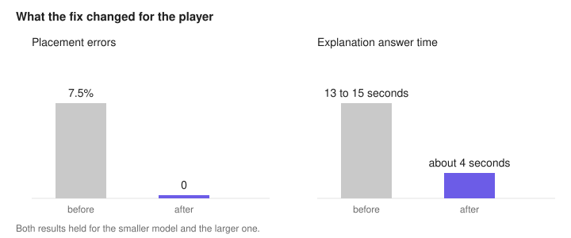
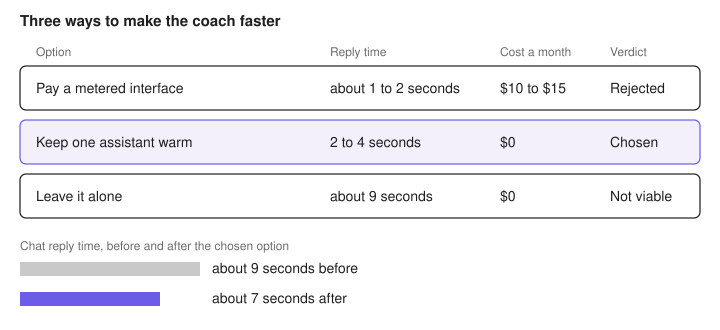
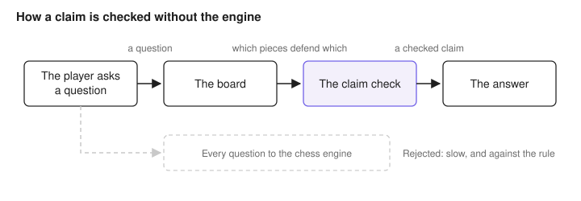

# Technical decisions

Five decisions from building this chess coach. In each one the obvious fix was the wrong one. I measured before I believed it. The first three shipped on 2026-07-22, the fourth on 2026-09-21, the fifth on 2026-09-22.

## The coach gave wrong answers, and a bigger model was not the fix

The coach answers questions about your game while you play. It used to work out where your pieces were by reading back through the move list, and it got that wrong often enough to matter. Now it reads the position the app has already computed. A check catches any claim that contradicts the board before the answer reaches you.

For the player: wrong statements about where pieces stand went from 7.5% to 0. The wait on an explanation question went from 13 to 15 seconds down to about 4 seconds.

### The evidence

Before the change, 1 in 13 piece-placement statements were false, and nothing checked them. The same questions were also the slowest on the whole product, because the model was working out the position live instead of reading an answer the app already held.

Both numbers held for Sonnet and Opus. The two models were tied on these two measures. A bigger model does not fill a gap in the facts. It reasons more fluently from the same missing information.

Getting an honest measurement took two attempts. The first one leaned on a language model as the judge. Its "wrong" pile and its "accurate" pile disagreed with ground truth at almost the same rate, 13% versus 5%. No discriminating power, so I retired it. One of the mechanical checks was flattering itself too. It asked whether the coach knew about the move being considered, and its raw pass rate read about 70%, because it counted a square as known whenever a piece happened to be there already. A hand audit put the genuine rate near 4 in 14, and that is the number I reported.

The rebuilt measurement, baseline v2, runs the same fixed questions against both models: completeness 100% for both, length within budget 25% for Sonnet and 3% for Opus, jargon-free 53% and 15%, latency medians about 9.7 seconds for both.

### What it cost

The coach gave up room to reason. Every placement claim now has to survive a check against the board, and a claim that fails never reaches you, interesting or not.

Where this lives: question routing in `server/coach/intent.ts`, the facts and the validator in `server/coach/chat.ts`, the harness in `tools/coach-eval/`, and the full results in [the eval dashboard](coach-eval-v3-dashboard.html).

## The coach was too slow, and I did not pay to fix it

The coach talks to you during the game, not only when you ask it something. Those live comments run on a fifteen second budget. They missed it so often that most of what I saw was a canned template rather than a real answer. Keeping one assistant process warm instead of starting a new one per message fixed it without adding a bill.

For the player: live narration now lands in about 3.6 seconds and chat in about 7.

### The evidence

Every coach reply writes a row saying which path served it, whether it was a real answer or a fallback template, and how long it took. I read the rows rather than guessing.

Chat was acceptable, about 9 seconds a reply. The live comments were not. 13 of 14 nudges and 16 of 23 warnings had blown the budget and dropped to a template. From the outside, a template looks like a real answer. Most of those 9 seconds was the process starting up, not the model thinking.

That gave three options. A metered interface would answer in about 1 to 2 seconds for about $10 to $15 a month, billed outside my personal plan. Starting one assistant once and keeping it warm would answer in 2 to 4 seconds at $0, still on the plan. Leaving it alone kept the 9 seconds and the templates.

### What it cost

I turned down the fastest option. Only I use this tool. A recurring bill to save a second or two on it buys nothing. The metered interface stays documented as the route for a hosted version, where a personal account could not be the login anyway.

The other half of the fix cost me a layout. The chat used to open as a window over the board, so even a quick reply made me stop and wait for it. It now sits in the coach's corner, beside the board on a wide screen and under it on a laptop. I can keep playing while a reply arrives. The warm process fixes how long a reply takes. The corner fixes how long it feels. Both were needed.

Where this lives: the warm path drops in as a third coach backend behind a swap seam designed three increments earlier, and every reply it serves writes a trace row.

## The coach could not tell which pieces were protected

Mid game I asked whether my pawn on e4 protected my bishop on f5. The coach said no, and called the bishop undefended. It was defended. A separate warning told me I was about to lose that same bishop, and I was not. Two surfaces, one blind spot.

For the player: the app works out which pieces protect which directly from the board. That map goes to the coach as a fact, and any claim that contradicts it never sends. The warning calls a capture you can take back a trade rather than a loss.

### The evidence

The game settled it a few moves later. mallow, the computer opponent, took my bishop on f5 with hers, and my e4 pawn took back: the recapture the coach had said was not there. The warning had made the same mistake from the other direction, so the model was not the only thing getting it wrong.

### What I did not do

The tempting fix was to run every answer past the chess engine first. I rejected it. The engine returns a move and a score. It never says that one square protects another, because that is geometry rather than a search. It would also have cost an engine call on every chat message, on the one surface I had just made fast. It breaks a rule I set early on: the chat never touches the engine's queue.

What I built instead closes one specific hole, false claims about what protects what. It does not make the coach right about everything else, and it should not be read that way.

Where this lives: the defender map is read off the board by the chess library the app already carries, and the claim check runs in the coach's validator before an answer sends.

## When real chess terms sound like AI-isms: banning "quietly" and "quiet move" while teaching chess vocabulary

The coach kept calling moves "quiet". "Quietly" as a softener is a language-model tic, and I had banned it in the coach's persona on 2026-09-08 with a carve-out for the chess term "quiet move", a move that is not a check, a capture or a threat. The carve-out was the problem. "A quiet regrouping move" and "a quiet move to untangle her pieces" both reached me in game 198, and to a player they read as the same tic. The term is real. It still tells you nothing about why the move was played.

For the player: the coach never says quiet, quietly or quieter about a move. It names what the move does instead, from a fixed vocabulary.

### The evidence

The word had reached me once as a softener in 335 stored coach replies, and never since the persona line. So the line worked. What the record also showed is why: the list of banned words in the code that carried "quietly" was used only by the evaluation harness. Nothing on the live path ran it. The live check banned six words, all engine jargon. A banned word that only the prompt enforces holds until the model decides the chess sense is allowed, which is exactly what happened.

The vocabulary came from a sourced pass over the standard glossaries: Wikipedia's glossary of chess and its articles on prophylaxis, tempo, sacrifice and the in-between move, plus two coaching pages on the checks-captures-threats method. Nineteen terms, grouped by the one split every coach uses: does the move force a reply or not.

### The vocabulary

A move that forces a reply is one of these.

<table>
<thead><tr><th style="background:#6c5ce7;color:#ffffff;text-align:left;padding:6px 10px">word</th><th style="background:#6c5ce7;color:#ffffff;text-align:left;padding:6px 10px">what the move does</th></tr></thead>
<tbody>
<tr><td style="padding:6px 10px">check</td><td style="padding:6px 10px">attacks her king</td></tr>
<tr><td style="padding:6px 10px">capture</td><td style="padding:6px 10px">takes a piece or pawn</td></tr>
<tr><td style="padding:6px 10px">en passant</td><td style="padding:6px 10px">a pawn takes a pawn that just passed it (a capture)</td></tr>
<tr><td style="padding:6px 10px">trade</td><td style="padding:6px 10px">a capture she can take back; material stays level</td></tr>
<tr><td style="padding:6px 10px">threat</td><td style="padding:6px 10px">attacks a piece or a square she has to answer</td></tr>
<tr><td style="padding:6px 10px">pawn break</td><td style="padding:6px 10px">a pawn hits her pawn chain</td></tr>
<tr><td style="padding:6px 10px">sacrifice</td><td style="padding:6px 10px">gives material for something bigger</td></tr>
<tr><td style="padding:6px 10px">in-between move</td><td style="padding:6px 10px">answers a threat with a bigger threat first</td></tr>
</tbody>
</table>

A move that forces nothing is one of these. This is the whole territory "quiet" used to cover.

<table>
<thead><tr><th style="background:#f3f0fb;color:#1f1f1f;text-align:left;padding:6px 10px">word</th><th style="background:#f3f0fb;color:#1f1f1f;text-align:left;padding:6px 10px">what the move does</th></tr></thead>
<tbody>
<tr><td style="padding:6px 10px">developing move</td><td style="padding:6px 10px">a piece leaves its starting square into play</td></tr>
<tr><td style="padding:6px 10px">regrouping move</td><td style="padding:6px 10px">a piece already in play goes to a better square</td></tr>
<tr><td style="padding:6px 10px">retreat</td><td style="padding:6px 10px">a piece steps out of danger</td></tr>
<tr><td style="padding:6px 10px">preventing move</td><td style="padding:6px 10px">stops her plan before it starts (the textbook word is prophylactic, which I dropped as too clinical)</td></tr>
<tr><td style="padding:6px 10px">waiting move</td><td style="padding:6px 10px">passes the turn and keeps everything as it is</td></tr>
<tr><td style="padding:6px 10px">consolidating move</td><td style="padding:6px 10px">tidies up after an attack</td></tr>
<tr><td style="padding:6px 10px">king-safety move</td><td style="padding:6px 10px">tucks the king away</td></tr>
<tr><td style="padding:6px 10px">castling</td><td style="padding:6px 10px">the king-safety move where king and rook swap sides in one turn</td></tr>
<tr><td style="padding:6px 10px">pawn advance</td><td style="padding:6px 10px">gains space</td></tr>
<tr><td style="padding:6px 10px">promotion</td><td style="padding:6px 10px">the pawn advance that reaches the last rank and becomes a queen</td></tr>
<tr><td style="padding:6px 10px">preparing move</td><td style="padding:6px 10px">sets up a forcing move next</td></tr>
</tbody>
</table>

A move that does two things is named by the forcing one, because that is what the opponent has to answer. "Blocking move" is left out on purpose: in chess it already means putting a piece between a check and your king, so using it for prevention would give one word two meanings.

### How it is enforced

<table>
<thead><tr><th style="background:#e5e5e5;color:#1f1f1f;text-align:left;padding:6px 10px">layer</th><th style="background:#e5e5e5;color:#1f1f1f;text-align:left;padding:6px 10px">where it runs</th><th style="background:#e5e5e5;color:#1f1f1f;text-align:left;padding:6px 10px">what it does</th><th style="background:#e5e5e5;color:#1f1f1f;text-align:left;padding:6px 10px">if it fails</th></tr></thead>
<tbody>
<tr><td style="padding:6px 10px">persona paragraph</td><td style="padding:6px 10px">in the prompt, every coach call</td><td style="padding:6px 10px">steers the first attempt toward the vocabulary</td><td style="padding:6px 10px">nothing stops the word yet</td></tr>
<tr><td style="padding:6px 10px">live check</td><td style="padding:6px 10px">on every reply before it sends</td><td style="padding:6px 10px">rejects any form of "quiet" and tells the retry to name what the move does, without repeating the banned word</td><td style="padding:6px 10px">the reply is rewritten once, then falls back to a template</td></tr>
<tr><td style="padding:6px 10px">template lint</td><td style="padding:6px 10px">in the test suite, before any merge</td><td style="padding:6px 10px">fails the build if a code-written string or the persona file uses the word</td><td style="padding:6px 10px">the change cannot merge</td></tr>
</tbody>
</table>

Two debrief strings changed under the lint: "fifty quiet moves" became "fifty moves with no capture or pawn move", and "a quieter move" became "a slower move".

### What it cost

The coach can no longer say "quiet move", a term real chess books use, and its prompt is one paragraph longer. Code checks only that the banned word is gone. It does not check that the coach picked the right word for a move. I judge that reply by reply, the same way I judge any other claim it makes.

Where this lives: the vocabulary in `server/coach/personas/coach.md`, the live check and the retry instruction in `server/coach/chat.ts`, the template lint in `src/review/templateVoice.test.ts`, the harness copy of the banned list in `server/coach/voiceRules.ts`.

## 7 in 8 rejections were wrong: fixing the board check's precision instead of deleting it

The coach checks every claim about where a piece stands before you see it. It compared each claim to the current board only. When the coach described where a piece would stand after a move in the line it was explaining, the check called that false and threw the answer away. The easy fix was to delete the check. I kept it and taught it which boards the coach was talking about.

For the player: fewer thrown-out coach answers, each of which cost a 20-second retry or a canned template.

### The evidence

In game 198 the check rejected 16 coach answers. 14 were true statements about the position after a move. The other 2 were wrong, and the check still catches both.

I did not want to wait for new games to prove the fix. I took the positions from 201 stored coach conversations and generated true and false statements about each, labelled by the rules engine. Then I ran them through the check before and after the change.

**How well the board check judged the coach's claims.** A statement is one claim the coach makes about where a piece stands, such as "your knight is on f3". A rejection is the check refusing a coach answer because it judged a statement in it false.

<table>
<thead><tr><th style="background:#6c5ce7;color:#ffffff;text-align:left;padding:6px 10px">measure</th><th style="background:#6c5ce7;color:#ffffff;text-align:left;padding:6px 10px">what it counts</th><th style="background:#6c5ce7;color:#ffffff;text-align:left;padding:6px 10px">measured on</th><th style="background:#6c5ce7;color:#ffffff;text-align:left;padding:6px 10px">before the fix</th><th style="background:#6c5ce7;color:#ffffff;text-align:left;padding:6px 10px">after the fix</th></tr></thead>
<tbody>
<tr><td style="padding:6px 10px">precision</td><td style="padding:6px 10px">rejections that were actually wrong</td><td style="padding:6px 10px">game 198's 16 rejected answers</td><td style="padding:6px 10px">2 of 16 (12.5%)</td><td style="padding:6px 10px">2 of 2 (100%)</td></tr>
<tr><td style="padding:6px 10px">recall</td><td style="padding:6px 10px">false statements the check caught</td><td style="padding:6px 10px">2,243 generated false statements</td><td style="padding:6px 10px">100%</td><td style="padding:6px 10px">100%</td></tr>
<tr><td style="padding:6px 10px">false positive rate</td><td style="padding:6px 10px">true statements wrongly rejected</td><td style="padding:6px 10px">144 generated statements about the position after a move</td><td style="padding:6px 10px">45%</td><td style="padding:6px 10px">0%</td></tr>
<tr><td style="padding:6px 10px">false positive rate</td><td style="padding:6px 10px">true statements wrongly rejected</td><td style="padding:6px 10px">4,772 generated true statements</td><td style="padding:6px 10px">1.4%</td><td style="padding:6px 10px">0%</td></tr>
</tbody>
</table>

Precision comes from game 198's real rejections, since generated statements would inflate it: I chose how many false ones to make. Recall and the false positive rates come from the generated statements, because nobody has labelled every claim the coach made in play.

A check that has only been seen passing proves nothing, so I broke the fix on purpose. With the move lines taken out, the after-move rejections came straight back.

### What it cannot catch yet

The check now accepts a claim that is true on any board the coach was shown, up to four moves down a line. So a claim about the current board that only becomes true a few moves later would pass, and the 100% recall above is measured against that rule. The sweep built 25 such statements to confirm the check lets them through. Nothing yet measures how often the coach writes one in play.

The check also runs only on chat. The one-line coach notes under the board are not checked for piece positions at all.

Next on the roadmap: record which board confirmed each claim in every coach reply, so the passes that only work a few moves ahead can be counted in real play, and decide whether the notes under the board get the same check.

Where this lives: the placement check in `server/coach/placementClaims.ts`, the move lines it reads in `server/coach/chat.ts`, and the sweep in `tools/checker-sweep/`.
